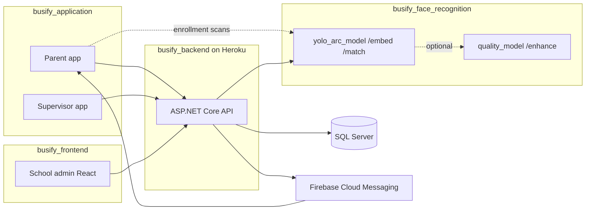

# Busify Mobile Application — Study Guide

**Repository:** `busify_application`  
**Stack:** Flutter (Dart 3.10+), Android & iOS  
**Role in Busify:** Mobile client for **parents** and **bus supervisors** — registration, child management, live bus tracking, face enrollment, and trip attendance.

---

## Table of contents

1. [What this project is](#1-what-this-project-is)
2. [How it fits in the full system](#2-how-it-fits-in-the-full-system)
3. [Tech stack](#3-tech-stack)
4. [Project structure](#4-project-structure)
5. [App entry and navigation](#5-app-entry-and-navigation)
6. [User roles and main screens](#6-user-roles-and-main-screens)
7. [Services and API layer](#7-services-and-api-layer)
8. [Key business flows](#8-key-business-flows)
9. [Face enrollment (parent)](#9-face-enrollment-parent)
10. [Maps, GPS, and live tracking](#10-maps-gps-and-live-tracking)
11. [Push notifications](#11-push-notifications)
12. [Configuration](#12-configuration)
13. [Build and run](#13-build-and-run)
14. [Study questions → where to look](#14-study-questions--where-to-look)
15. [Related repositories](#15-related-repositories)

---

## 1. What this project is

Busify’s **native mobile app** (package name `application`). It does **not** include the school admin web dashboard (see `busify_frontend`) or the .NET API (see `busify_backend`). It talks to the backend over HTTPS and optionally calls the **face AI Space** directly during parent enrollment scans.

Two primary personas:

| Persona | Purpose |
|---------|---------|
| **Parent** | Register, add children, enroll faces (5 scans), track bus on map, receive approvals/rejections |
| **Supervisor** | Run trips, scan students (face/QR), upload GPS, view route map, confirm attendance |

---

## 2. How it fits in the full system



---

## 3. Tech stack

| Area | Libraries |
|------|-----------|
| UI | Flutter Material, Google Fonts, HeroUI-style custom theme |
| HTTP | `http` — REST to backend |
| Auth storage | `shared_preferences` via `TokenStorage` |
| Maps | `google_maps_flutter`, `latlong2` |
| Location | `geolocator` (foreground service on Android) |
| Camera / photos | `image_picker` |
| Push | `firebase_core`, `firebase_messaging` |
| Permissions | `permission_handler` |

---

## 4. Project structure

```
lib/
├── main.dart                 # App bootstrap, theme, splash
├── constants/                # Colors, images, GPS constants
├── models/                   # User, Child, School, LoginResponse, …
├── screens/
│   ├── onboarding/         # Splash, role selection, onboarding slides
│   ├── parent/             # Login, signup, home, track bus, add child, profile
│   └── supervisor/         # Login, home, trip, map, QR confirm, attendance
├── services/
│   ├── service_locator.dart  # DI: token, parent, supervisor, school services
│   ├── parent_service.dart   # /v1/parent/*
│   ├── supervisor_service.dart
│   ├── school_service.dart   # GET /v1/schools (anonymous)
│   ├── push_notifications_service.dart
│   ├── live_location_uploader.dart
│   └── trip_live_updates.dart
├── widgets/
│   └── parent/parent_face_enrollment.dart  # 5-scan flow + HF /embed
├── helpers/                  # Maps, GPS smoothing, API JSON, feedback UI
└── utils/
    ├── api_config.dart       # Backend base URL
    └── maps_config.dart      # Google Maps keys
android/                      # Manifest (location foreground service permissions)
ios/
assets/images/
```

---

## 5. App entry and navigation

**Entry:** `lib/main.dart`

1. `ServiceLocator.init()` — wires `TokenStorage`, services, theme.
2. `PushNotificationsService.init()` — FCM handlers.
3. `MaterialApp` → `LaunchSplashScreen` → role selection or saved session.

Navigation is mostly **imperative** (`Navigator.push` / `pushReplacement`) with `fadeRoute` transitions, not a global named-route table.

---

## 6. User roles and main screens

### Parent (`lib/screens/parent/`)

| Screen | File | What it does |
|--------|------|----------------|
| Login / signup | `parent_login_screen.dart`, `parent_signup_*` | Auth + multi-step registration with children |
| Home | `parent_home_screen.dart` | Child overview, shortcuts |
| Track bus | `parent_track_bus_screen.dart` | Map + live trip polling |
| Add child | `parent_add_child_screen.dart` | School picker, grade, 5 face scans, submit |
| Profile | `parent_profile_screen.dart` | Children list, re-scan badge, rejected flow |

### Supervisor (`lib/screens/supervisor/`)

| Screen | File | What it does |
|--------|------|----------------|
| Home | `supervisor_home_screen.dart` | Dashboard, boarded / not-yet counts |
| Trip | `supervisor_trip_screen.dart` | Active trip, mini-map, GPS upload, scan entry |
| Full map | `supervisor_full_map_screen.dart` | Full-screen route map |
| QR / confirm | `supervisor_qr_confirmation_screen.dart` | Post-scan confirmation, live attendance counts |
| Attendance | `supervisor_attendance_screen.dart` | Trip student list |

### Onboarding (`lib/screens/onboarding/`)

First-run marketing slides and **role selection** (parent vs supervisor).

---

## 7. Services and API layer

**Base URL:** `lib/utils/api_config.dart` → `ApiConfig.baseUrl` (production: Heroku).

| Service | Backend prefix | Responsibility |
|---------|----------------|----------------|
| `ParentService` | `/v1/parent` | Register, login, profile, add/resubmit child, attendance, trip, notifications |
| `SupervisorService` | `/v1/supervisor` | Login, trips, GPS, face identify/confirm, attendance |
| `SchoolService` | `/v1/schools` | Public school list for signup / add-child |
| `AuthService` | — | Token + user id in `SharedPreferences` |

JWT is sent as `Authorization: Bearer <token>` on authenticated calls (`ParentService._authHeaders()`).

---

## 8. Key business flows

### Parent registration

1. Info screen → student screen (school + children + face scans).
2. `POST /v1/parent/register` with `schoolId` and `children[]` (embeddings optional).
3. Children start as **`linkStatus: pending`** until school admin approves (web app).

### Add another child (possibly different school)

1. `parent_add_child_screen.dart` loads schools via `SchoolService.getSchools()`.
2. User picks school in bottom sheet, completes 5 face scans.
3. `POST /v1/parent/child` with `schoolId` + `parentId` + `embeddingJson`.
4. Student is tied to **that school**; parent account is global (see backend README).

### School approval (not in this app)

Handled in **`busify_frontend`** → `POST /v1/school-admin/approve-parent`. Parent receives FCM and opens profile.

### Supervisor trip + attendance

1. `POST /v1/supervisor/start-trip` (or start-current-trip).
2. App uploads GPS: `POST /v1/supervisor/live-location` (see `live_location_uploader.dart`).
3. Face scan: backend `face-identify` → UI `supervisor_qr_confirmation_screen` → `face-confirm`.
4. `TripLiveUpdates` notifies map/home to refresh without full page reload.

---

## 9. Face enrollment (parent)

**File:** `lib/widgets/parent/parent_face_enrollment.dart`

- **`kParentEnrollmentScanCount = 5`** — must match backend averaging.
- Calls Hugging Face Space: `kParentFaceApiBaseUrl` + `/embed` (override with `--dart-define=FACE_API_URL=...`).
- Quality failures: `face_too_small`, `face_too_blurry` → user-friendly messages.
- Final averaged embedding JSON is sent to backend on register/add-child/resubmit.

Supervisor **matching** during trips is done **on the backend** (not direct HF calls from supervisor scan path in most cases).

---

## 10. Maps, GPS, and live tracking

| Component | Role |
|-----------|------|
| `live_gps_tracker.dart` / `gps_stream_helper.dart` | Stream position with smoothing |
| `smoothed_lat_lng.dart` | Reduce map jitter |
| `live_location_uploader.dart` | Batch POST supervisor coordinates |
| `parent_track_bus_screen.dart` | Poll `GET /v1/parent/current-trip` + live location |
| `supervisor_trip_screen.dart` | Mini-map follow bus; recenter flag avoids gesture conflicts |

**Android:** `AndroidManifest.xml` declares `FOREGROUND_SERVICE` + `FOREGROUND_SERVICE_LOCATION` for Geolocator.

---

## 11. Push notifications

**File:** `lib/services/push_notifications_service.dart`

- Registers FCM token: `POST /v1/parent/device-token`.
- Foreground messages → in-app handling.
- Types include `student_link_approved`, `student_link_rejected` → navigate to `ParentProfileScreen`.

---

## 12. Configuration

| Setting | Location |
|---------|----------|
| API URL | `lib/utils/api_config.dart` |
| Face API URL | `lib/widgets/parent/parent_face_enrollment.dart` or `--dart-define=FACE_API_URL` |
| Google Maps | `lib/utils/maps_config.dart` + platform API keys |

---

## 13. Build and run

```bash
cd busify_application
flutter pub get
flutter run
```

Release:

```bash
flutter build apk
flutter build ios
```

**Branch note:** Active development often on `Feature`; backend on `main`.

---

## 14. Study questions → where to look

| Question | Start here |
|----------|------------|
| How does login store the token? | `lib/services/token_storage.dart`, `auth_service.dart` |
| How is a child added with another school? | `parent_add_child_screen.dart`, `parent_service.dart` → `addChild` |
| Why 5 face scans? | `parent_face_enrollment.dart` → `kParentEnrollmentScanCount` |
| How does supervisor scan work? | `supervisor_service.dart`, backend `SupervisorController` face endpoints |
| Map not following bus? | `supervisor_trip_screen.dart` (`_isRecentering`, `_recomputeNearestNextStop`) |
| Parent map wrong destination? | Backend `ParentController.GetCurrentTrip` (bus-wide stops) |
| Push when school approves child? | `push_notifications_service.dart` |
| Remaining students count wrong? | `supervisor_home_screen.dart` + backend `GET /v1/supervisor/me` |

---

## 15. Related repositories

| Repo | README |
|------|--------|
| Backend API | `../busify_backend/README.md` |
| School admin web | `../busify_frontend/README.md` |
| Face AI services | `../busify_face_recognition/README.md` |

---

*Last updated for Busify graduation project documentation — use with backend and AI READMEs for end-to-end understanding.*
